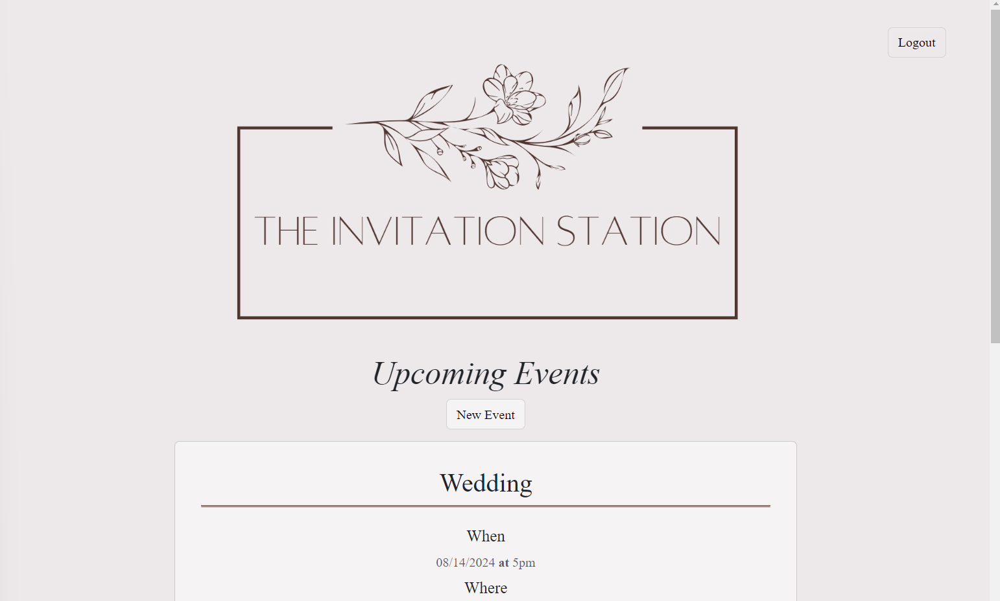

# The Invitation Station 

  
  
  ## Description
  
  Create beautifully customized invitations effortlessly for weddings, parties, and events with our intuitive invitation generator. Choose from a variety of elegant templates, personalize with your event details, and download or share your invitations hassle-free. Make every occasion memorable with our easy-to-use invitation creation tool.
  
  ## Table of Contents 
  
  
  
  - [Installation](#installation)
  - [Usage](#usage)
  - [Credits](#credits)
  - [License](#license)
  - [Questions](#questions)
  - [Tests](#tests)
  
  ## Installation
  
  In the terminal run "npm i" followed by "npm run develop". Once the port is listening then you can paste the URL in the browser and you should see the website login page.

  Here is a [link](https://github.com/sondavid85/TheInvitationStation) to the github repo.

  See screenshot of working site: 
  
  

  
  ## Usage
  
  This app is intended for individuals who would like help keeping track of their hosted events, providing a place to store all of your event details in one place.
  
  
  
  
  ## Credits
  
  Jeremy Permaul https://github.com/jpermaul 
  Nicole Bruhbaker https://github.com/NicoleBrubaker 
  David Barsi https://github.com/sondavid85
  
  ## License
  
  This application is covered under the MIT license.
  
  ## Questions

  For additional questions you can reach me at the following:
  see above
  n/a

  ## Tests

  n/a
  
  
  
  

